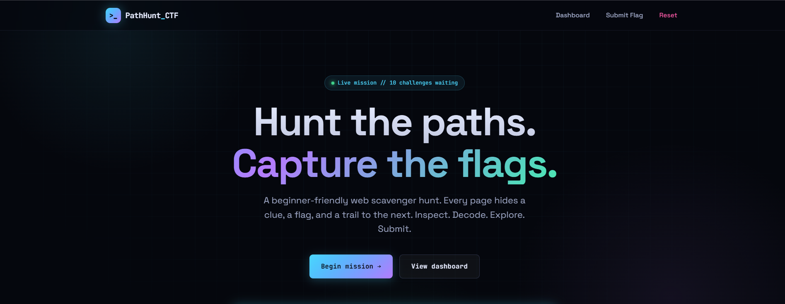
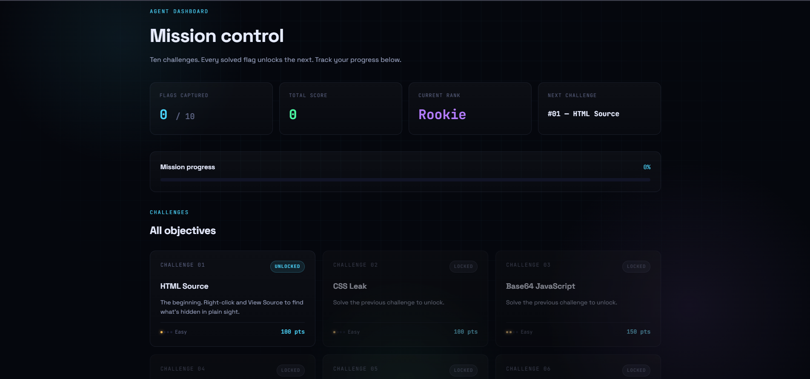
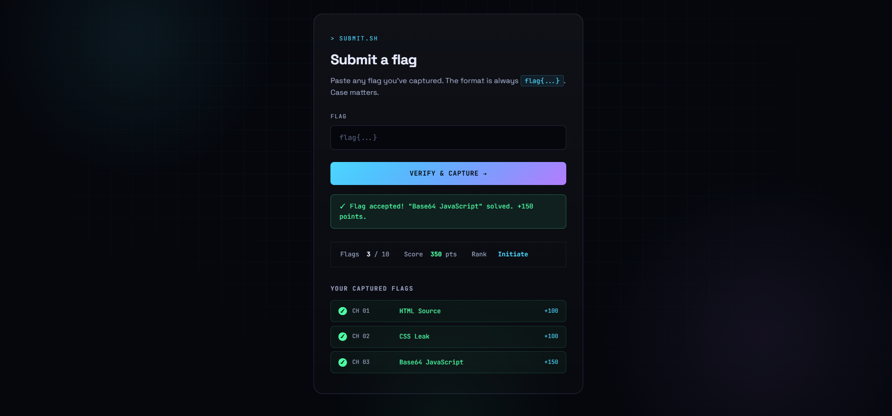

# PathHunt CTF

**Hunt hidden paths. Capture flags. Learn web security.**

PathHunt CTF is a beginner-friendly, self-contained web scavenger hunt. Ten static HTML challenges teach the core reflexes of web reconnaissance — reading source, decoding payloads, exploring directories, inspecting headers, tampering with cookies, finding hidden APIs, and bypassing client-side auth.

---

## 🎯 What you'll learn

| #   | Challenge                | Technique                               |
| --- | ------------------------ | --------------------------------------- |
| 01  | HTML Source              | Reading HTML comments via View Source   |
| 02  | CSS Leak                 | Inspecting linked stylesheets           |
| 03  | Base64 JavaScript        | `atob()` decoding in the console        |
| 04  | Robots Recon             | Reading `robots.txt` for a site map     |
| 05  | Directory Fuzzing        | Guessing unlinked paths                 |
| 06  | HTTP Headers             | Inspecting response headers / meta tags |
| 07  | Cookie Tampering         | Modifying cookies to escalate privilege |
| 08  | Hidden API               | Watching the Network tab for XHR calls  |
| 09  | Client-side Login Bypass | Reading auth logic in JS                |
| 10  | Fragment Reassembly      | DOM recon across meta, attributes, comments, CSS, and JS |

Each challenge hides two things: **a flag** (`flag{...}`) to submit, and **a path** to the next challenge.

---

## 🚀 Quick start

### Option 1 — Open locally

```bash
git clone https://github.com/AkramAldahyani/PathHunt-CTF.git
cd PathHunt-CTF
npm start
```

> **⚠️ Use `npm start` (which runs `npx serve .`) — do not use Python's `http.server`, VS Code Live Server, or any other static server.**
> Some challenges rely on custom HTTP response headers configured in `serve.json`. Other servers ignore this file and will cause those challenges to behave incorrectly (e.g. `curl -I` won't return the expected headers).

Then open **http://localhost:3000** in your browser.

---

## 📸 Screenshots

<strong>Welcome page</strong><br>


<strong>Dashboard</strong><br>


<strong>Submit flags</strong><br>


---

## 🧭 How the hunt works

1. **Start at `index.html`** — the landing page.
2. **Click Begin Mission** to go to Challenge 01.
3. **On each challenge page:** find the flag and the next path. Use View Source, DevTools, the Network tab, whatever it takes.
4. **Submit flags** at `submit.html`. Solved flags are stored in your browser's `localStorage`.
5. **Track progress** on `dashboard.html` — see your score, rank, and remaining challenges.

All ten flags to collect (don't peek if you want the challenge):

<details>
<summary>🚩 Click to reveal all flags (spoilers)</summary>

```
flag{welcome_hunter}
flag{css_master}
flag{decode_me}
flag{robots_are_useful}
flag{fuzzing_works}
flag{header_hunter}
flag{cookie_tamper}
flag{api_explorer}
flag{client_side_fail}
flag{you_completed_it}
```

</details>

---

## ⚠️ Educational use only

This project is a **teaching tool**. The techniques it demonstrates (directory fuzzing, cookie tampering, reading client-side auth, inspecting API traffic) should only ever be applied to:

- Your own infrastructure
- Targets with explicit written authorization
- Public CTF competitions
- Platforms designed for testing (HackTheBox, TryHackMe, PortSwigger Web Security Academy, PicoCTF)

Using these techniques against systems you don't own or haven't been authorized to test is illegal in most jurisdictions.

---

## 📚 Where to go next

If you enjoyed PathHunt and want to level up:

- **[PortSwigger Web Security Academy](https://portswigger.net/web-security)** — free, hands-on labs, the gold standard for web app security
- **[PicoCTF](https://picoctf.org/)** — beginner-friendly annual CTF with year-round practice problems
- **[TryHackMe](https://tryhackme.com/)** — guided rooms covering web, network, and binary topics
- **[HackTheBox](https://www.hackthebox.com/)** — more advanced, adversarial practice machines
- **[OWASP Top 10](https://owasp.org/www-project-top-ten/)** — the canonical list of the most common web vulnerabilities

---

## 🤝 Contributing

Issues and pull requests welcome. Ideas for good contributions:

- More challenges (SQL injection simulation, JWT decoding, SSRF concepts, prototype pollution, etc.)
- Accessibility improvements
- Alternative themes

---

## 📄 License

MIT — use, modify, share, remix. If you deploy a public version, a link back to this repo is appreciated but not required.

---

**Good hunting, agent.** ◼
